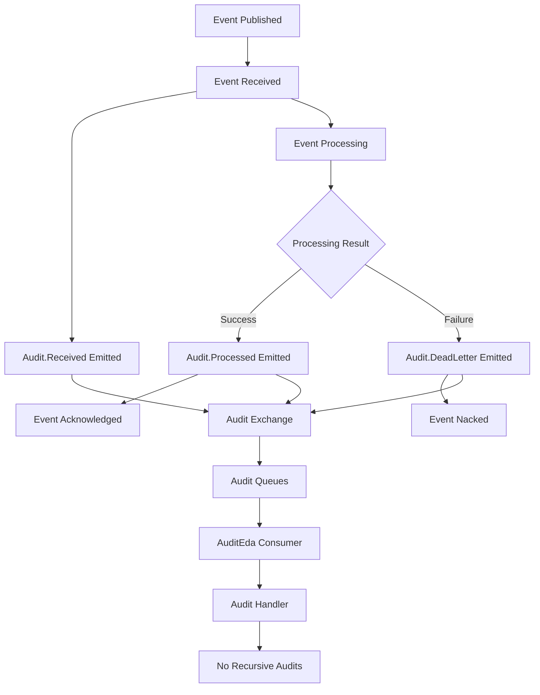

# 🚀 Legend-Saga Library Development Guide

> **Production-Ready Rust Saga Pattern Library with Comprehensive Audit Logging**

## 📋 Project Overview

**Legend-saga** is a robust Rust library designed for microservice communication via RabbitMQ, implementing sophisticated event-driven patterns with reliable messaging capabilities. The library has evolved to production-ready status with comprehensive audit logging capabilities.

### Core Components

- 🔄 **Event-Driven Architecture**: Publish/subscribe messaging with headers-based routing
- 🎯 **Saga Pattern Implementation**: Orchestration and compensation patterns for distributed transactions
- 📊 **Comprehensive Audit System**: Real-time tracking of event lifecycle (received, processed, dead-letter)
- 🛡️ **Resilient Messaging**: Built-in retry mechanisms with fibonacci backoff strategies
- 🧪 **Production-Grade Testing**: Extensive test suite with containerized infrastructure

### Current Status: ✅ Production Ready

- **Version**: 0.0.37
- **Test Coverage**: 33 passing tests (100% when run via `make test`)
- **⚠️ Testing Requirement**: Individual tests MUST use `--test-threads=1` for RabbitMQ container compatibility
- **Audit Integration**: Fully operational across all event flows
- **Branch**: `feat/poc_audit` (ready for main merge)

---

## 🔄 Recent Changes (vs main)

### 🆕 Major Additions

- **Audit Event Types**: Added `AuditReceived`, `AuditProcessed`, `AuditDeadLetter` events
- **AuditHandler**: New specialized handler preventing recursive audit emissions
- **Direct Exchange Pattern**: Efficient single-consumer delivery for audit events
- **Automatic Audit Emission**: Integrated into EventHandler lifecycle (ack/nack operations)

### 📁 Modified Files

```
legend-saga/src/
├── connection.rs      # Added audit emitter management
├── consumers.rs       # New audit exchange/queue infrastructure
├── events.rs         # Audit event types and payloads
├── events_consume.rs # AuditHandler + automatic audit emission
├── nack.rs           # Enhanced with audit dead-letter tracking
├── publish_event.rs  # Direct audit event publishing methods
├── queue_consumer_props.rs # Audit queue definitions
├── start.rs          # Audit consumer connection + comprehensive tests
└── test.rs           # Enhanced test infrastructure
```

### 🧪 Test Enhancements

- **Audit Consumer Tests**: Full lifecycle testing with proper synchronization
- **Real Flow Tests**: End-to-end validation with TestImage → AuditEda flows
- **Dead Letter Testing**: Verification of both delay and fibonacci strategies
- **Non-Recursive Validation**: Ensures audit events don't trigger recursive audits

---

## 🏗️ Codebase Analysis

### ✅ Strengths

| Aspect             | Quality    | Notes                                                  |
| ------------------ | ---------- | ------------------------------------------------------ |
| **Architecture**   | ⭐⭐⭐⭐⭐ | Clean separation of concerns, modular design           |
| **Error Handling** | ⭐⭐⭐⭐⭐ | Comprehensive `RabbitMQError` with proper propagation  |
| **Concurrency**    | ⭐⭐⭐⭐⭐ | Safe async patterns with Arc/Mutex for shared state    |
| **Test Coverage**  | ⭐⭐⭐⭐⭐ | 33 tests covering edge cases and integration scenarios |
| **Documentation**  | ⭐⭐⭐⭐   | Inline docs present, could benefit from more examples  |

### 🔍 Key Metrics

- **Lines of Code**: ~4,615 lines across 15 modules
- **Dependencies**: Well-curated with optional features (events, std)
- **Performance**: Async-first with efficient connection pooling
- **Security**: No credential exposure, secure RabbitMQ patterns

### ⚠️ Areas for Improvement

1. **Payload Logging**: Audit events currently don't capture original payloads
2. **Error Resilience**: Audit failures could be more gracefully handled
3. **Configuration**: Hard-coded values could be made configurable

---

## 🔍 Audit Log Deep Dive

### 🌊 Event Flow Diagram



### 🎯 Integration Points

1. **Event Reception**: `events_consume.rs:370` - Auto-emit audit.received
2. **Event Acknowledgment**: `events_consume.rs:41` - Auto-emit audit.processed
3. **Event Rejection**: `events_consume.rs:73` - Auto-emit audit.dead_letter
4. **Audit Consumption**: `start.rs:85` - Dedicated audit microservice connection
5. **Infrastructure**: `consumers.rs:283` - Direct exchange setup

### 🎯 Quick Wins Identified

#### 1. 📦 Add Payload Serialization (Low Effort)

```rust
// Current audit payload
pub struct AuditProcessedPayload {
    pub microservice: String,
    pub processed_event: String,
    // Add this field:
    pub original_payload: Option<serde_json::Value>,
}
```

**Effort**: 2-3 hours | **Impact**: High visibility into processed data

#### 2. 🛡️ Non-Blocking Audit Emission (Low Effort)

```rust
// Enhanced error handling in EventHandler::ack()
if let Err(e) = RabbitMQClient::publish_audit_event(audit_payload).await {
    // Log but don't fail the operation
    tracing::warn!("Audit emission failed: {:?}", e);
}
```

**Effort**: 1 hour | **Impact**: Improved system resilience

#### 3. ⚙️ Configurable Audit Settings (Medium Effort)

```rust
pub struct AuditConfig {
    pub enabled: bool,
    pub include_payload: bool,
    pub max_payload_size: usize,
}
```

**Effort**: 4-6 hours | **Impact**: Production flexibility

---

## 🗺️ Future Roadmap

### 🔥 High Priority

1. **Payload Inclusion**: Implement optional payload serialization in audit events

   - _Effort_: Low (2-3 hours)
   - _Impact_: Enhanced audit trail visibility

2. **Audit Configuration**: Make audit behavior configurable per microservice

   - _Effort_: Medium (4-6 hours)
   - _Impact_: Production deployment flexibility

3. **Performance Metrics**: Add audit processing latency tracking
   - _Effort_: Medium (3-4 hours)
   - _Impact_: Operational insights

### 🔄 Medium Priority

4. **Batch Audit Emission**: Group multiple audit events for efficiency

   - _Effort_: High (8-10 hours)
   - _Impact_: Reduced network overhead

5. **Audit Persistence**: Add database storage option for audit events
   - _Effort_: High (12-16 hours)
   - _Impact_: Long-term audit retention

### 🔮 Long Term

6. **Audit Analytics**: Dashboard and reporting capabilities
7. **Event Replay**: Ability to replay events from audit trail
8. **Compliance Features**: GDPR, SOX compliance enhancements

---

## 🎯 Session Guidelines

### 🚀 Getting Started

```bash
# Standard development workflow
make format # Format code
make lint   # Check for issues
make test   # Run full test suite (includes container setup)
make all    # Run everything

# Individual test debugging (CRITICAL: use --test-threads=1)
LOG_LEVEL=info cargo test --lib test_name -- --test-threads=1 --nocapture --color always
```

### 🐛 Debugging Tips

- **Test Failures**: Always use `make test` (handles Docker containers)
- **⚠️ CRITICAL**: Individual tests MUST use `--test-threads=1` for RabbitMQ containers
- **Audit Issues**: Check `LOG_LEVEL=info` output for detailed flow
- **Connection Problems**: Verify RabbitMQ containers are running

### 💡 Feature Development

1. **New Events**: Add to `MicroserviceEvent` enum + payload struct
2. **New Microservices**: Update `AvailableMicroservices` enum
3. **Test Integration**: Use `TestSetup` with proper audit configuration
4. **Branch Comparison**: Use `git diff main` to see audit-related changes

### 🔍 Code Review Checklist

- [ ] Audit events properly emitted for new event types
- [ ] Tests include audit flow validation
- [ ] No recursive audit emissions (use `AuditHandler`)
- [ ] Error handling doesn't break audit chain
- [ ] Performance impact assessed for high-volume events

### 📚 Key Files to Know

| File                | Purpose                 | When to Modify                  |
| ------------------- | ----------------------- | ------------------------------- |
| `events.rs`         | Event definitions       | Adding new events/payloads      |
| `events_consume.rs` | Core event handling     | Changing event processing logic |
| `start.rs`          | Connection management   | Adding new microservice types   |
| `consumers.rs`      | RabbitMQ infrastructure | Queue/exchange modifications    |
| `test.rs`           | Test utilities          | Enhancing test capabilities     |

---

**📞 Need Help?** This codebase is well-structured and extensively tested. When in doubt:

1. Check existing patterns in similar modules
2. Run tests early and often with `make test`
3. Use audit logs to trace event flows
4. Leverage the comprehensive test suite for validation

**🎯 Next Session**: Specify which feature area you'd like to focus on, and I'll provide targeted analysis and implementation guidance.
